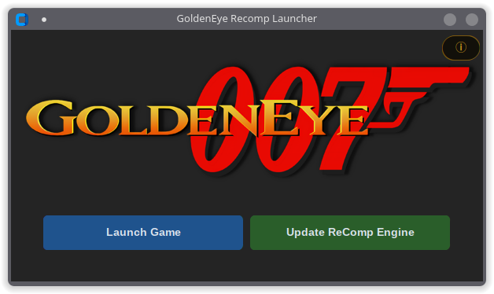

# GoldenEye Recomp Launcher

A portable launcher and updater for [**GoldenEye Recomp**](https://github.com/SunJaycy/GoldenEye-Recomp).

<p align="center">

</p>

## Requirements

- **[7-Zip](https://www.7-zip.org)** or **[WinRAR](https://www.rarlab.com)** must be installed (Windows) to use the Update ReComp Engine feature.
- On Linux, install `7zip` or `unrar` via your package manager.

## Installation

### Windows

1. Go to [**Releases**](https://github.com/DarkXero-dev/GELauncher/releases/latest) and download `GoldenEye Launcher.exe`
2. Place it in your GoldenEye Recomp game folder (same folder as `GoldenEye.exe`)
3. Run it - no install needed

### Linux

1. Go to [**Releases**](https://github.com/DarkXero-dev/GELauncher/releases/latest) and download `GoldenEye-Launcher.AppImage`
2. Place it in your GoldenEye Recomp game folder (same folder as `GoldenEye.exe`)
3. Make it executable and run:

```bash
chmod +x GoldenEye-Launcher.AppImage
./GoldenEye-Launcher.AppImage
```

The launcher uses `wine` to launch `GoldenEye.exe`. Make sure Wine is installed on your system.

## Usage

| Button | What it does |
|---|---|
| **Launch Game** | Starts GoldenEye Recomp and minimizes the launcher to the taskbar |
| **Update ReComp Engine** | Checks GitHub for the latest engine release, downloads and installs it automatically |

---

## Building from Source

### Windows

```bat
pip install -r requirements.txt
build.bat
```

Output: `dist\GoldenEye Launcher.exe`

### Linux

Requires Python 3 and `tk` (`sudo pacman -S tk` on Arch).

```bash
chmod +x build_linux.sh
./build_linux.sh
```

Output: `GoldenEye-Launcher.AppImage`
