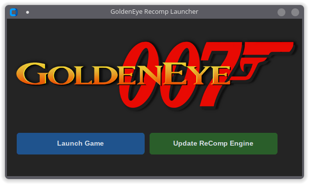

# GoldenEye Recomp Launcher

A portable Windows launcher/updater for [**GoldenEye Recomp**](https://github.com/SunJaycy/GoldenEye-Recomp).

<p align="center">



</p>

## Requirements

- **[7-Zip](https://www.7-zip.org)** or **[WinRAR](https://www.rarlab.com)** must be installed to use the Update ReComp Engine feature.

## Installation

1. Go to [**Releases**](https://github.com/DarkXero-dev/GELauncher/releases/latest) and download `GoldenEye Launcher.exe`
2. Place it in your GoldenEye Recomp game folder (same folder as `GoldenEye.exe`)
3. Run it - no install needed

## Usage

| Button | What it does |
|---|---|
| **Launch Game** | Starts GoldenEye Recomp and minimizes the launcher to the system tray |
| **Update ReComp Engine** | Checks GitHub for the latest engine release, downloads and installs it automatically |

To restore from the tray: double-click the tray icon, or right-click and choose **Restore**.
To quit: right-click the tray icon and choose **Quit**.

---

## Linux Notes

The launcher runs on Linux via Wine. Use any of these compatibility layers:

[**Wine**](https://www.winehq.org) &nbsp;·&nbsp; [**Lutris**](https://lutris.net) &nbsp;·&nbsp; [**Bottles**](https://usebottles.com) &nbsp;·&nbsp; [**Heroic**](https://heroicgameslauncher.com)

For the **Update ReComp Engine** feature, install `7zip`, `p7zip` or `unrar` on your system:

```bash
# Arch / CachyOS / Manjaro
sudo pacman -S 7zip

# Ubuntu / Debian
sudo apt install p7zip-full

# Fedora
sudo dnf install p7zip
```
